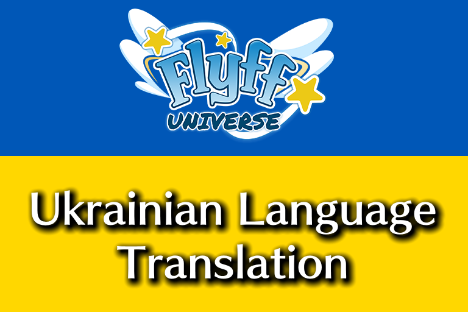

# Flyff Universe Ukrainian Language Translation

This is the repository that was created by me which I translated Ukrainian Language due to the Russo-Ukrainian war ongoing.

The project was started in February 21, 2026 and the official localisation repository can be found [here](https://github.com/gala-lab/flyff-universe-translations).

## What is this?
I started to make Ukrainian language in the favour of the Russo-Ukrainian war. Many protesters of Ukraine people that even destroyed, bombing, and even more.

In February 21, 2026, I've decided to translate Ukrainian language, and that explains why only have one language **Russian** exists. In the answer of Notepad++, They also provided to support Ukraine as it is, under slogan **We Are with Ukraine** since Version 8.8 and 8.8.1.

## The Idea
One of my idea is simple, GSC Game World (the company who develops *STALKER 2: Heart of Chornobyl*) was moved to the Poland in the answer of Russian Invasion of Ukraine. The reason is why I made this repository which I would love to translate Ukrainian language before publishing the new release, in the future release of Flyff Universe.

Flyff Universe also offers **Russian (Русский)**, although they will be kept as it is. The idea for me is we should add Ukrainian language in the favour of Russo-Ukrainian war, including it's Presdient of Ukraine (Zelenskyy).

### Notepad++'s Ukraine support

Don Ho, published the version 8.3.2 release and can be found [here](https://notepad-plus-plus.org/news/v832-declare-variables-not-war/), It was titled **Declare variables, not war**. The Russian Invasion of Ukraine was indeed which it had major fatalities, including where Ukraine people protests Russian.

Several versions of Notepad++ including 8.3.3 titled **Make Apps, not war** and also 8.4 titled **Keep standing up for Ukraine**.

In hindsight, Notepad++ also offers donation to Ukraine country that can be found [here](https://notepad-plus-plus.org/donate-to-ukraine). As the United24 is still here, they have been donated a lot of money over $3.5+ Billion.

## Do I need help for translation of Ukraine?
Absolutely yes, You can also fork this repository and we'll show later if we can correcting some text, or even fixing typos text.

Gala Lab are also provided the localisation repository of Flyff Universe. In case, We are not ready yet to add the language as because we cannot add languages indefinite future.

## Support
We always support with Ukraine country. Our people required for donation and can be found at [United24](https://u24.gov.ua). This way, We always stand with Ukraine.

**Do more to stop war - keep helping Ukraine**

## Copyright

* Copyright (C) 2002-2026 Gala Lab Corp. All rights reserved.
